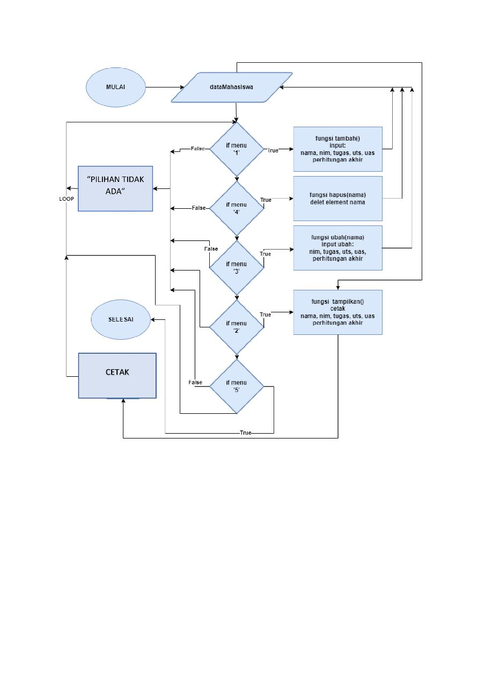
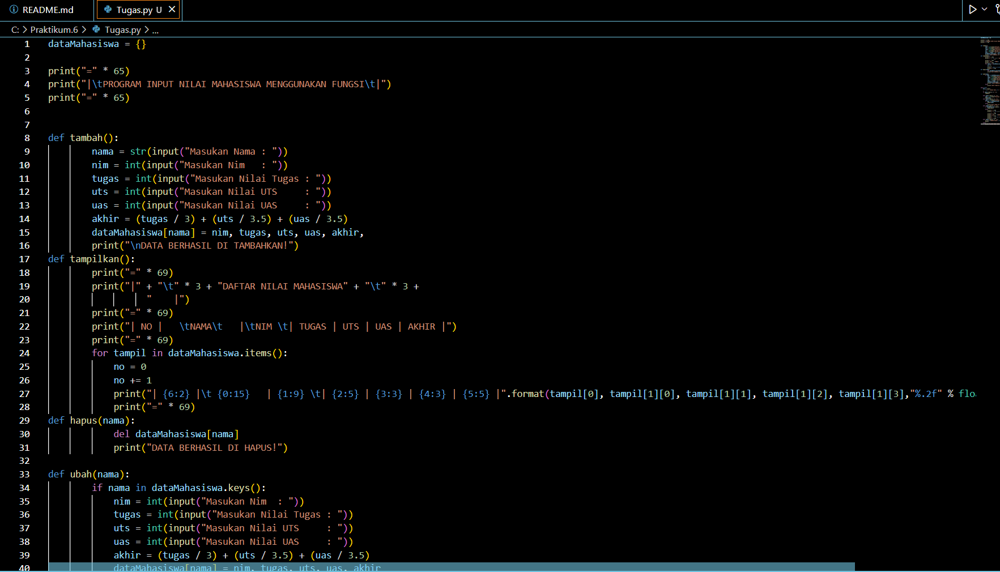
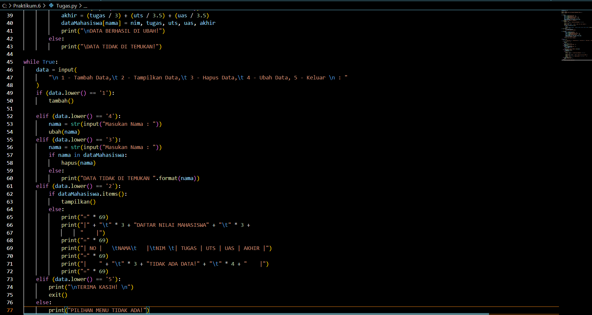
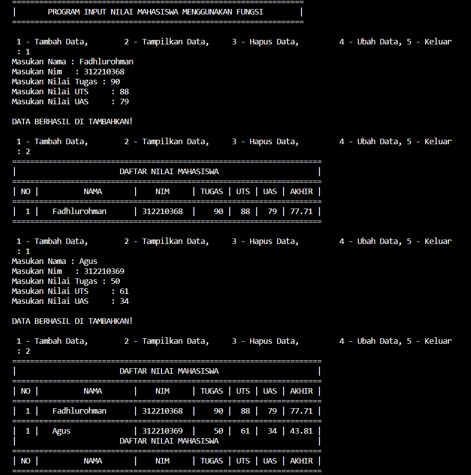
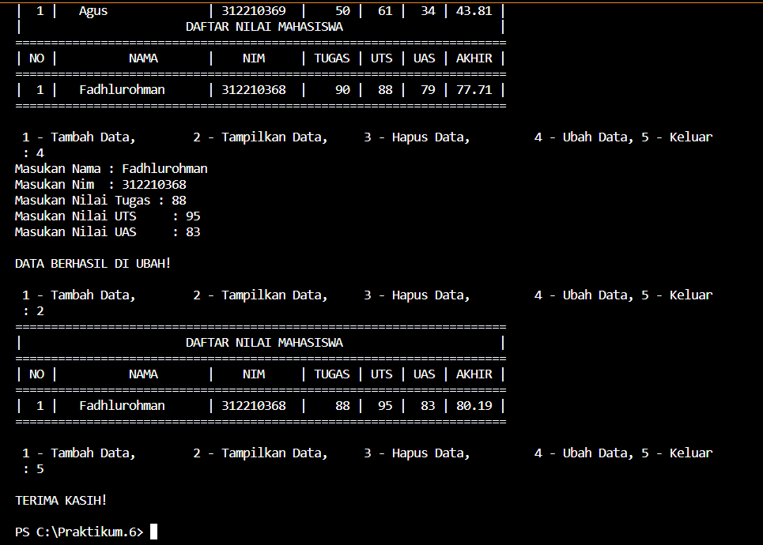

# Praktikum.6

# FLOWCHART

# PENJELASAN PROGRAM

1. Mendeklarasi dictionary dengan dataMahasiswa untuk menampung semua data.
2. Menambahkan fungsi def tambah() di isi dengan inputan nama, nim, tugas, uts, uas dan total nilai akhir untuk dan di masukan ke data Mahasiswa.
3. Menambahkan fungsi def tampilkan() di isi dengan cetak isi dari dictonary.
4. Menambahkan fungsi def hapus(nama) di isi dengan program untuk menghapus element nama pada data Mahasiswa.
5. gunakan fungsi def ubah(nama) di isi dengan inputan nama dan mengubah isi element pada nama tersebut.
6. gunakan while True untuk menlooping/mengulang statment.
7. gunakan statment if, elif, else, di dalam while True dan panggil fungsi dari masing masing fungsi, contoh:
- tambah()
- tampilkan()
- hapus(nama)
- ubah(nama)
8. selesai

# TAMPILAN PROGRAM

# OUTPUT PROGRAM

